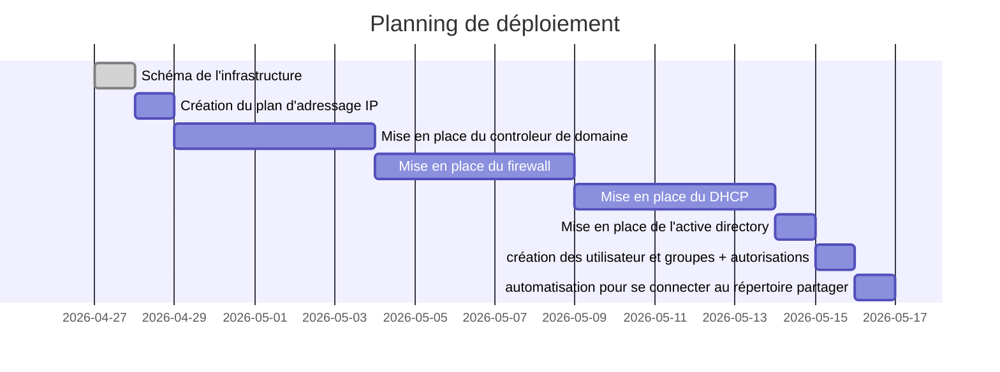
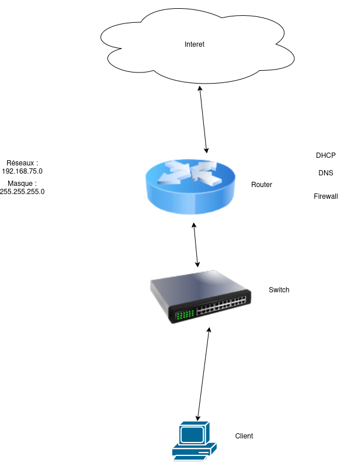
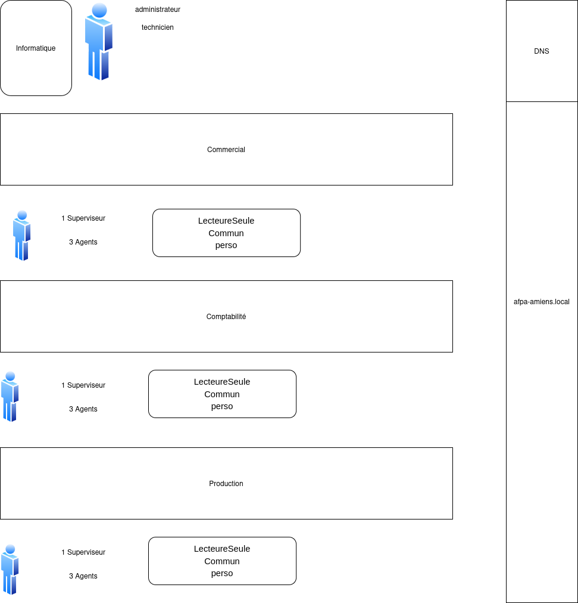

# planning pour le réseaux Afpa

Liste des tâches à réaliser:
- Schéma de l'infrastructure
- Création du plan d'adressage IP
- Mise en place du controleur de domaine
- Mise en place du firewall 
- Mise en place du DHCP
- Mise en place de l'active directory
- création des groupes + autorisations
- création des repertoire partagés 
- automatisation pour se connecter au répertoire partager
-
- ...
- Tests

### Shéma de l'infrastructure

