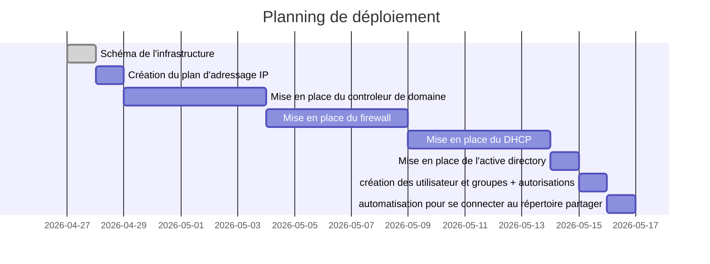

# planning pour le réseaux Afpa

Liste des tâches à réaliser:
- Schéma de l'infrastructure
- Création du plan d'adressage IP
- Mise en place du controleur de domaine
- Mise en place du firewall 
- Mise en place du DHCP
- Mise en place de l'active directory
- création des groupes + autorisations
- création des repertoire partagés 
- automatisation pour se connecter au répertoire partager
-
- ...
- Tests

### Shéma de l'infrastructure

###  Création du plan d'adressage IP
|               | adresse ip   | masque        | utilisateurs | superviseurs | agents | getway       | dns               | serveurs     | plage d’adresse     |
|---------------|--------------|---------------|--------------|--------------|--------|--------------|-------------------|--------------|---------------------|
| réseau        | 192.168.60.0 | 255.255.255.0 | 14           | 4            | 10     | 192.168.60.1 | Afpa-amiens.local | 192.168.60.1 | 192.168.60.50 à 100 |
| informatiique |              | 255.255.255.0 | 2            | 1            | 1      | 192.168.60.1 | Afpa-amiens.local | 192.168.60.1 | 192.168.60.50 à 100 |
| production    |              | 255.255.255.0 | 4            | 1            | 3      | 192.168.60.1 | Afpa-amiens.local | 192.168.60.1 | 192.168.60.50 à 100 |
| commercial    |              | 255.255.255.0 | 4            | 1            | 3      | 192.168.60.1 | Afpa-amiens.local | 192.168.60.1 | 192.168.60.50 à 100 |
| Comptabilité  |              | 255.255.255.0 | 4            | 1            | 3      | 192.168.60.1 | Afpa-amiens.local | 192.168.60.1 | 192.168.60.50 à 100 |